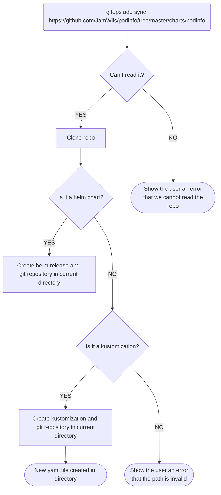

```mermaid
flowchart TB
    id1(gitops add sync https://github.com/JamWils/podinfo/tree/master/charts/podinfo) --> id2{Can I read it?}
    id2 --> |YES| id3[Clone repo]
    id3 --> id4{Is it a helm chart?}
    id4 --> |YES| id5[Create helm release and \ngit repository in current directory]
    id2 ---> |NO| id6([Show the user an error\n that we cannot read the repo])
    id4 ---> |NO| id7{Is it a kustomization?}
    id7 --> |YES| id8[Create kustomization and \n git repository in current directory]
    id8 --> id9([New yaml file created in directory])
    id7 ---> |NO| id10([Show the user an error\n that the path is invalid])
```