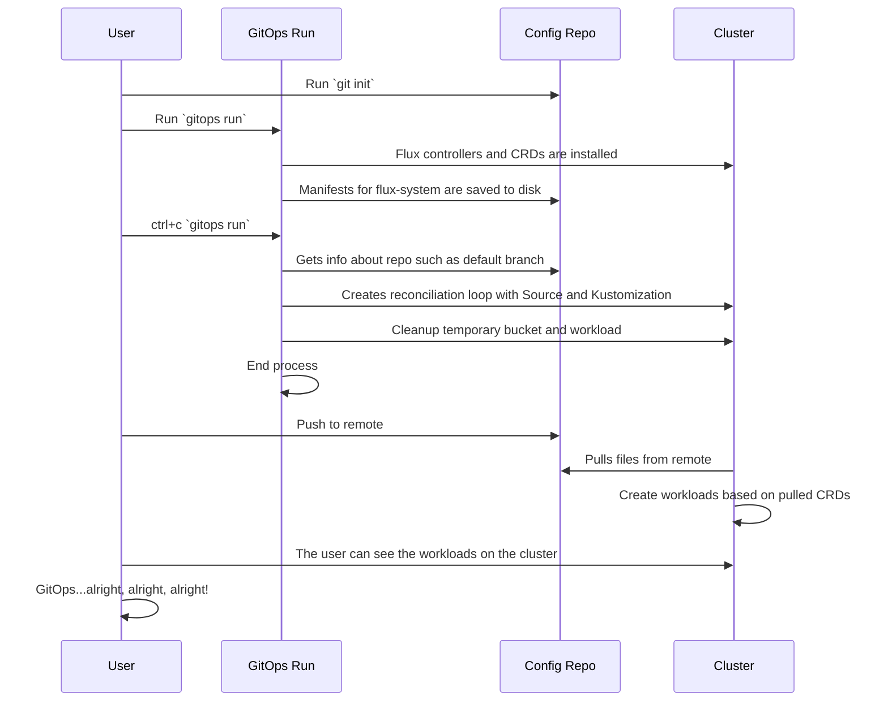
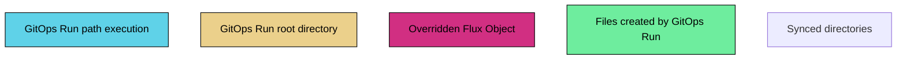

---

Here is a legend for executing `gitops run`


---
### Criteria
1. Flux is already installed on the cluster.
2. The **workload** already exists on the cluster.
3. The user is trying to update an existing workload and is running it in a specific directory.
4. All manifests are in the same repository.

```mermaid
%%{init: { logLevel:0, startOnLoad: false, themeCSS:'.label { font-family: Source Sans Pro,Helvetica Neue,Arial,sans-serif; }' }}%%
flowchart TD
    root --> 2g
    root --> 3g
    root --> 4g
    subgraph 4g[./clusters]
    subgraph sgp1 [ ]
      subgraph 400g[./my-cluster]
        subgraph sgp2 [ ]
        subgraph 410g[./app]
          d[dev-ks.yaml]
        end
        subgraph 401g[./flux-system]
          a[gotk-components.yaml] 
          b[gotk-sync.yaml]
          c[kustomization.yaml]
        end
        end
      end
    end  
    end
      
    subgraph 3g[./app]
    subgraph sgp3 [ ]
      31[app.yaml]
      end
    end
    subgraph 2g[./dev]
    subgraph sgp4 [ ]
      21[nginx.yaml]
      22[ns.yaml]
    end
    end
    
classDef subgraph_padding fill:none,stroke:none
class sgp1,sgp2,sgp3,sgp4 subgraph_padding

classDef basic fill:transparent;
class 3g,4g,400g,401g,410g basic;

style 2g fill:#5fd2e8,stroke:#000,color:#000;
style root fill:#ebd08b,stroke:#000,color:#000;
style d fill:#d12f82,stroke:#000,color:#000;
````