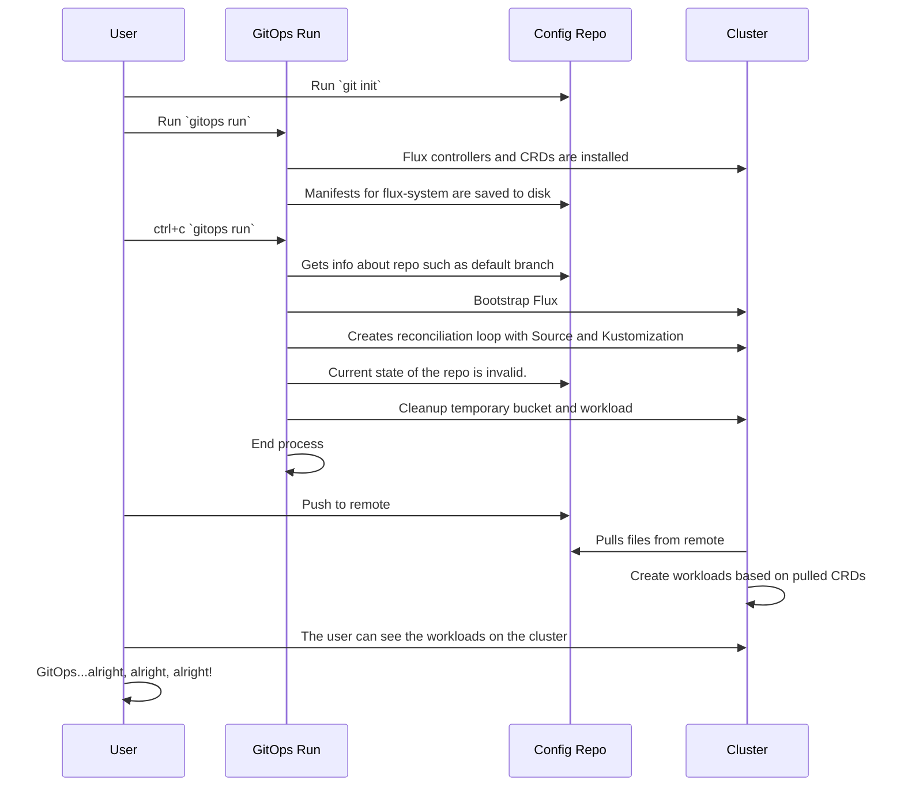
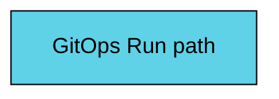
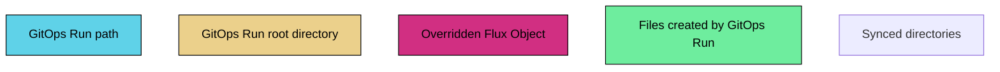

```mermaid
   
```


# Phase 2

We are still focusing on the platform operator in this phase that needs to configure a cluster and wants to see live feedback as they are working.  Once they are done they should be able to turn off `gitops run` and return to a GitOps paradigm.  

## Definitions

To help drive conversations we are going to lay out some terminology to help us drive things forward.

### Modes
1. **GitOps:** this is the default mode we are always aiming for when using Weave GitOps.  Whenever `gitops run` is not active we want users to be in this mode.  This means that the cluster is being driven by some mechanism reading from git, ideally **flux**, and that system is applying those changes to the cluster.
2. **Run:** this is when the cluster has `gitops run` running on the cluster.  There is a live reload session that is occuring and the cluster is no longer in a pure GitOps or Snowflake mode.  Ideally, when `gitops run` stops running that the cluster enters into the GitOps mode that is defined above.
3. **Snowflake:** we are referring to a cluster that is driven by some other mechanism outside of `GitOps` or `Run`.  For example, a platform operator could have ran various `kubectl apply` commands and installed a couple helm charts using `helm`.  The only way for this cluster to reach this state again is to rerun those commands or to transition to GitOps mode.

### Sessions

What happens when you start `gitops run` and then stop it?  There are at least two different options that we could start with and they are defined below.

1. **Version:** create a "side version" of the same workload.  This means we would keep something running in the `dev` namespace, but would create a sub namespace so you have two versions running in different namespaces.  This would be useful for being able to quickly use services to compare the two.  This helps application teams scale and use less clustsers.
2. **Replace:** this will replace the existing workload on the cluster with what exists in the current working directory.  This is much more invasive on the cluster and limits the number of people that can interact with the same workload.

## Goals

As a user when I am trying to do work on a cluster I want to be able to migrate from various modes and transition to `GitOps` mode.  This means I should be able to enter `run` mode on clusters that are in `gitops` or `snowflake` mode and either respectively return/transition the state of the cluster into `gitops` mode or by the end.

that is configured with Flux I have to go through various steps for solving that problem.

1. I want to be able to swtich between `run` and `gitops` mode.
2. Being able to run `gitops run` on a cluster that is already configured with Flux and GitOps.
3. With phase one we guaranteed that `gitops run` would work with Kind, Minikube, Docker Desktop, and k3d.  By the end of this phase we should be able to work with remote clusters such as EKS, GKE, etc.
4. The path can run against both `Kustomization` or `Helm Releases`.

## Out of Scope

While we can offer the capability to not enter **GitOps mode** after running `gitops run`, that functionality is out of scope for this epic.

Running "version" sessions is out of scope.  We will focus on "replace" sessions only for this epic.

We are not going to worry about flux being installed anywhere else except `flux-system`.

We cannot gracefully handle "raw" helm charts. If you're managing your application with helm, you'd need to template the chart first. As in, I can't run `gitops beta run ./charts/gitops-server` for weave-gitops.

## User Stories

- As a developer, I want to be able to run a simple command that will allow me to point to a working directory.  This working directory should be a git repository.  The upstream of this git repository (i.e. GitHub, GitLab, BitBucket) is irrelevant.

- As a developer, I want to be able to specify the directory which contains my manifests when working with sync.  This will enable these manifests to be pulled in locally so you can see the changes get applied.  I should see a new cloud native `Bucket` source appear which contains the manifests for that branch.

- As a developer, when I turn off sync then the temporary objects should be removed from my cluster and the cluster should be back in the state that Flux had put it in.

- As a developer, as I make a changes to my manifests in my local repository I should see those changes reflected on the cluster as the files are uploaded to the `Bucket` on the cluster.  For example, if I create a new ConfigMap with various values then I should see that ConfigMap on the cluster without taking any additional action such as `kubectl apply` or “pushing” my changes to a remote git server for Flux to sync.

- As a user I expect for non-namespace entities to be handled gracefully.  This means that if I am running `gitops run` against a path that is installing `Tekton`, `Contour`, or some other tooling with CRDs that `gitops run` is able to gracefully transition into `run` mode.


---

You can see the run path as the following color:


---

Here is a legend for executing `gitops run`


---
## GitOps Run used for the first time on a new cluster

- As a developer, I should be able to see changes appear live in the GitOps dashboard under the requisite `Kustomization` or `HelmRelease`.

### Criteria
1. This is a brand new cluster
2. Flux is not already installed on the cluster.
3. The **workload** does not exist on the cluster.
4. All manifests are in the same repository.
5. `gitops run` is run on the basic path

```mermaid
%%{init: { logLevel:0, startOnLoad: false, themeCSS:'.label { font-family: Source Sans Pro,Helvetica Neue,Arial,sans-serif; }' }}%%
flowchart LR
    run[gitops run] --> cluster
    root <--> run
    subgraph root[root path: ./ ]
    subgraph sgp6 [ ]
    subgraph sgp7 [ ]
    subgraph clusters[./clusters]
    subgraph sgp1 [ ]
      subgraph my-cluster[./my-cluster]
        subgraph sgp2 [ ]
        dboard[gitops-dashboard.yaml]
        subgraph flux[./flux-system]
          a[gotk-components.yaml] 
          b[gotk-sync.yaml]
          c[kustomization.yaml]
        end
        end
      end
    end  
    end
    end
    end
    
    end
    subgraph cluster
      direction TB
      subgraph sgp5 [ ]
        c-a[We install Flux CRDs and Controllers]
        c-b[Temp Bucket and Kustomization]
        c-c[Dev Bucket Server]
      end
    end
      
    
classDef subgraph_padding fill:#000,stroke:none
class sgp1,sgp2,sgp3,sgp4,sgp5 subgraph_padding

classDef basic fill:#000;
class clusters,my-cluster,flux,app,cluster basic;

style root fill:#ebd08b,stroke:#000,color:#000
style sgp6 fill:#ebd08b,stroke:transparent,color:#000
style sgp7 fill:#5fd2e8,stroke:transparent,color:#000
classDef create fill:#6eed9e,stroke:#000,color:#000;
class a,b,c,dboard create
````

---

### Criteria

- As a developer, I expect to see a relevant `Kustomization` or `HelmRelease` that will sync with the cloud native `Bucket` source that was created above.
- As a developer, I might not have access to certain values such as database paths or keys which are located on the relevant dev `HelmRelease`.  These values should be copied over to the new temporary `HelmRelease` that is relevant to the branch.
- As a developer, when I switch to a new branch on my repository I should see my changes clear out of my temporary environment.  The `Kustomization` or `HelmRelease` should reflect the changes that are in my local working directory.

#### Scenario

1. Flux is already installed on the cluster.
2. The **workload** already exists on the cluster.
3. The user is trying to update an existing workload and is running it in a specific directory.
4. All manifests are in the same repository.

```mermaid
%%{init: { logLevel:0, startOnLoad: false, themeCSS:'.label { font-family: Source Sans Pro,Helvetica Neue,Arial,sans-serif; }' }}%%
flowchart LR
    run[gitops run] --> cluster
    root <--> run
    subgraph root[root path ./ ]
    subgraph sgp6 [ ]
    subgraph clusters[./clusters]
    subgraph sgp1 [ ]
      subgraph my-cluster[./my-cluster]
        subgraph sgp2 [ ]
        dboard[gitops-dashboard.yaml]
        subgraph app[./app]
          d[dev-ks.yaml]
        end
        subgraph flux[./flux-system]
          direction TB
          a[gotk-components.yaml] 
          b[gotk-sync.yaml]
          c[kustomization.yaml]
        end
        end
      end
    end  
    end
      
    subgraph app-manifests[./app]
    subgraph sgp3 [ ]
      31[app.yaml]
      end
    end
    subgraph dev[./dev]
    subgraph sgp4 [ ]
      21[nginx.yaml]
      22[ns.yaml]
    end
    end
    end
    end

    subgraph cluster
      direction TB
      subgraph sgp5 [ ]
        c-a[Flux already exists,\n no need to install]
        d --> c-d[Paused kustomization]
        c-b[Temp Bucket and Kustomization]
        c-c[Dev Bucket Server]
      end
    end
    
    
classDef subgraph_padding fill:none,stroke:none
class sgp1,sgp2,sgp3,sgp4,sgp5 subgraph_padding

classDef basic fill:#000;
class app-manifests,clusters,my-cluster,flux,app,cluster basic;

style dev fill:#5fd2e8,stroke:#000,color:#000;
style root fill:#ebd08b,stroke:#000,color:#000;
style sgp6 fill:#ebd08b,stroke:transparent,color:#000;
style d fill:#d12f82,stroke:#000,color:#000;
style c-d fill:#d12f82,stroke:#000,color:#000;
```